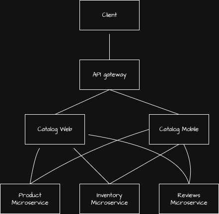

# Microservice Architecture Pattern

Consists of an approach to building software as a collection of small, independent and loosely coupled services, each responsible for a specific business function.

These services can be developed, deployed and scaled independently using communication protocols like (`REST`) to communicate with each other.

This pattern enhances flexibility and allows teams to use different technology stacks for different services.

**Core Principles**:

- Each service can be scaled without affecting the rest of the system.
- Each service manages its own database, which prevents data coupling.
- Each service is developed around specific business logic.

# Usage

Make sure you have `Node` installed, this project required `Node v22`.

1. Clone the project with `git clone https://github.com/yosang/microservice-architecture-pattern`
2. Install root project dependencies with `npm install`
3. Install microservice dependencies with `npm run build`
4. Run all the services with `npm start`
5. The API gateway runs on port `5000`, test the endpoints from the browser:
   ```
   GET http://localhost:5000/api/v1/web/products - Routes request to Products Catalog BFF for desktop clients
   GET http://localhost:5000/api/v1/mobile/products - Routes request to Products Catalog BFF for mobile clients
   ```

## API Gateway Pattern

Infrastructure focused, no business logic, protects and serves the bff's with requests from clients.

#### Responsibilities:

- Authentication / Authorization (JWT) enforcement.
- Rate limiting / throttling.
  - **[autocannon](https://www.npmjs.com/package/autocannon)**: configured with `1 min` window between each request and limited to `100 requests` each TCP client.
  - A simple test with `autocannon` configured with `--connections 5`, `--duration 15` and `--maxOverallRequests 250` shows the rate limiter blocking 100 of those requests: `100 2xx responses, 150 non 2xx responses`.
- Request routing.
- Basic request/response logging.
- Versioning (`/v1`, `/v2`...).

##### Endpoints

- GET /api/v1/web/products - Routes request to Products Catalog BFF for desktop clients
- GET /api/v1/mobile/products - Routes request to Products Catalog BFF for mobile clients

## Backend-for-frontends Pattern

Business logic focused, adapts and transforms data from microservices to the frontend.

#### Responsibilities:

- Call their targeted microservices in parallel style.
- Aggregate responses.
- Shape data for the frontend.
- Hide backend service details.
- Handle failures and implement error handling.

### Catalog Web BFF

##### Business Logic

Transforms and aggregates products, inventory and reviews data from microservices for desktop clients.

##### Endpoints

- GET /products - Returns a list of products tailored for desktop frontends.
- GET /products/:id - Returns one product.

### Catalog Mobile BFF

##### Business Logic

Transforms and aggregates products, inventory and reviews data from microservices for mobile clients.

##### Endpoints

- GET /products - Returns a list of products tailored for mobile frontends.
- GET /products/:id - Returns one product.

##### BFF specific features

- Pagination (limit/offset based)
- In-memory caching
- Compressed responses

### Microservices overview

Each service owns its data and rules.

- Product service owns product data.
- Inventory service owns inventory data.
- Each microservice is internally consistent.
- No services reaches eachothers data.
- No service knows about the BFF or the API gateway and its logic.

### Architecture Design and Decision making questions

#### Can I swap the frontend without touching the services?

- Say we swap React for Angular for the frontend, our services should not be affected by this change.

#### Can I change inventory logic without breaking the UI?

- Say the shape of one of the microservices API change, instead of adjusting to these changes from the frontend, we just work with the BFF to still return what the frontend expects.

#### Can I add mobile suport with a new BFF?

- Mobile support usually requires smaller payloads, fewer fields and latency-friendly responses.
- In this case, we could just implement a new BFF, specifically designed for the demands of a mobile frontend.
- Each BFF would then call the same services but still shape data differently and scale independently.

#### Can I add a new service without touching the gateway?

- If there were to be a need for a new service, we only need to deal with the BFF business logic.
- The gateway doesnt care what the BFF does as long as routing stays the same.
- The only time we should alter the gateway is if we need a new BFF (for example, for a new category of microservices)

#### Why not just call the BFF directly from the frontend?

Because they serve different purposes:

- **API Gateway**
  - Acts a single entry point for clients to access multiple backend services.
  - Centralizes request management, routing, monitoring and authentication/authorization
  - Minimal complexity.
  - Doesn't care about client types.
- **Backend-for-frontend**
  - Acts as a dedicated client-specific backend service (mobile app, tv app etc...).
  - Middleman between the frontend and various microservices.
  - High complexity, aggregates data and fetches data in parallel style.
  - Has to know the client-specific needs

At what point do we introduce a gateway then?

- When the BFF stops being a BFF...
- That is when we want to introduce more complexity such as:
  - **Authentication/authorization**: A BFF should only focus on business logic, auth should be separated.
  - **Monitoring**: We gain more insight about traffic behaviour from capturing and observing request/responses from a centralised service such as a gateway instead of every single BFF.
  - **Routing**: Incoming request should be directed to the appropiate BFF.

### Architecture Diagram



## Sources

- [Microsoft Backend-for-frontend](https://learn.microsoft.com/en-us/azure/architecture/patterns/backends-for-frontends#example)
- [Microsoft API gateways](https://learn.microsoft.com/en-us/azure/architecture/microservices/design/gateway)

# Author

[Yosmel Chiang](https://github.com/yosang)
